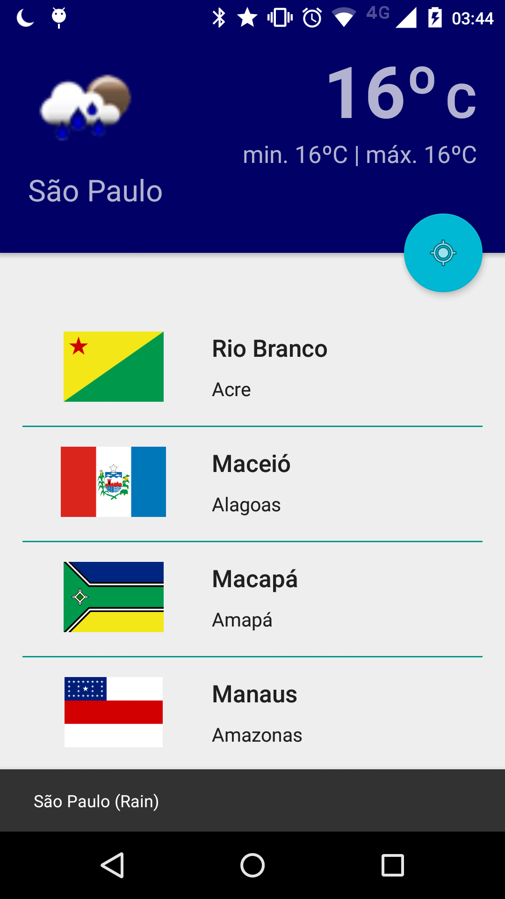

# Android-Clima
Aplicativo de teste para exibir o clima no android usando OpenWeatherMap

Imagem da temperatura capturada pela posição do GPS (latitude/longitude)

Temperatura exibida em graus Celsius.

Temperatura exibida em graus Fahrenheit.

Efeito de "ripple" para Androids v21+.

Layout em landscape.

### Bibliotecas utilizadas
##### Nativas
* [AppCompat] - com.android.support:appcompat-v7:23.0.1
* [Design] - com.android.support:design:23.0.1
* [PlayServices] - com.google.android.gms:play-services:8.1.0
* [ReciclerView] - com.android.support:recyclerview-v7:23.0.+

##### De terceiros
* [EventBus] - de.greenrobot:eventbus:2.4.0
* [Retrofit] - com.squareup.retrofit:retrofit:2.0.0-beta2
* [Gson] - com.squareup.retrofit:converter-gson:2.0.0-beta2
* [Picasso] - com.squareup.picasso:picasso:2.5.2

---
[AppCompat]:https://developer.android.com/tools/support-library/features.html
[Design]:http://android-developers.blogspot.com.br/2015/05/android-design-support-library.html
[PlayServices]:https://developers.google.com/android/guides/setup
[ReciclerView]:https://developer.android.com/training/material/lists-cards.html
[EventBus]:https://github.com/greenrobot/EventBus
[Retrofit]:http://square.github.io/retrofit/
[Gson]:https://github.com/google/gson
[Picasso]:http://square.github.io/picasso/
